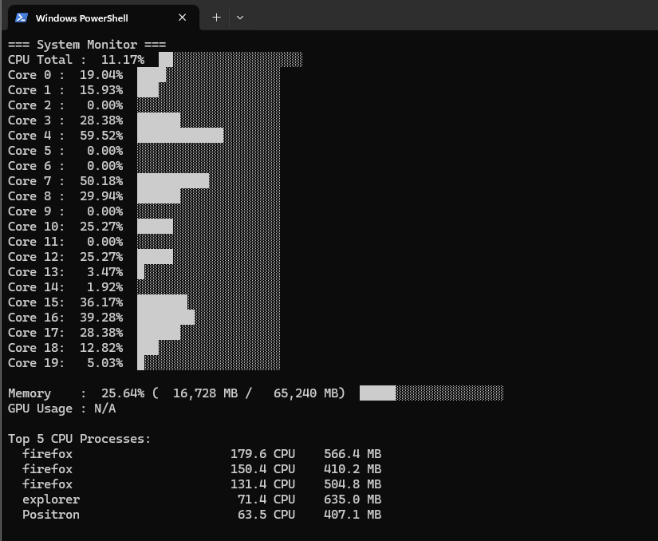

# sysmon.ps1

A tiny (yet experimental) PowerShell system monitor that displays live CPU, RAM, and GPU stats directly in your terminal — no GUI needed.

---

### 🖥️ Example Output

Here is what it looks like in action:



---

### 📊 What It Shows

* **CPU Total** — overall system CPU usage
* **Core X** — per-core utilization (each bar = activity level)
* **Memory** — RAM usage (used vs total in MB)
* **GPU Usage** — currently **not functional** on most systems and will show `N/A`
* **Top 5 CPU Processes** — five processes with the highest total CPU time since startup

💡 *Tip:* The “CPU” number per process (e.g., `149.6 CPU`) shows the **total accumulated CPU seconds** since the process started — it does not reset between updates.

---

### ⚙️ Usage

1. Open PowerShell and navigate to the folder containing the script:

   ```powershell
   cd C:\path\to\script
   ```
2. Run the monitor:

   ```powershell
   .\sysmon.ps1
   ```
3. To stop monitoring, press **Ctrl + C**.

The display refreshes every **5 seconds** and updates smoothly without blinking.

---

### ⚠️ Experimental

This project is **experimental** and may occasionally crash or display errors (especially due to Windows performance counter bugs).
If it stops unexpectedly, just re-run it.

---

### 🪪 License

Released under the **MIT License** — free to use, modify, and share ❤️
